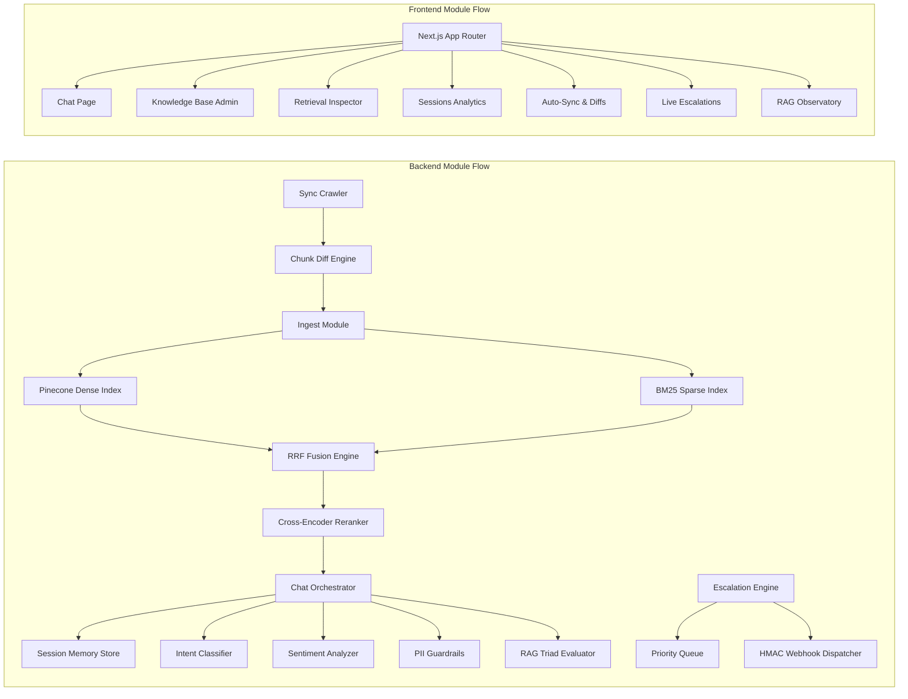

# Anchor — AI Customer Support Agent

A production-grade, RAG-powered customer support platform built for enterprise teams. Features Hybrid Retrieval-Augmented Generation combining Pinecone dense vector search with BM25 sparse keyword matching fused via Reciprocal Rank Fusion (RRF), a two-stage Cross-Encoder reranker, inline grounded citations, contextual multi-turn session memory with LLM query reformulation, a Zero-Shot intent classifier across 7 support taxonomies, sentiment dip detection, automated knowledge base web crawling and chunk-level semantic diffs, HMAC-signed webhook escalations to Zendesk/Slack, priority HITL triage queuing, RAG Triad observability (Context Relevance, Faithfulness, Answer Relevance), multi-model cost tracking, PII redaction guardrails, and a full-featured Next.js 15 App Router dashboard.

## Features

### Core Functionality
- **Grounded Conversational Chat**: Customers receive answers strictly sourced from the indexed knowledge base, with inline numbered citations `[1]` pointing to exact document sections
- **Hard Similarity Gate**: Responses are only generated when retrieval confidence exceeds the `0.75` threshold — below it, the agent gracefully declines rather than hallucinate
- **Knowledge Base Management**: Upload Markdown, PDF, TXT, and HTML documents which are automatically chunked, embedded with `text-embedding-3-small`, and upserted into Pinecone
- **Session Continuity**: 10-turn sliding window memory maintains context across multi-turn conversations, resolving pronouns and follow-ups into standalone retrievable queries
- **Human Escalation (HITL)**: Any conversation can be escalated to a human agent with a full transcript, priority score, and HMAC-SHA256 verified webhook dispatch

### Advanced Features
- **Hybrid RRF Retrieval**: Combines dense semantic vector search (Pinecone) and sparse BM25 keyword matching via Reciprocal Rank Fusion. The `α` weight parameter controls the dense-to-sparse balance, fully tunable from the Retrieval Inspector UI
- **Cross-Encoder Two-Stage Reranker**: After RRF fusion, a cross-encoder reranks the top candidates by jointly scoring the query and each passage — dramatically improving precision on technical queries
- **Multi-Query Expansion**: Decomposes complex multi-part questions into atomic sub-queries, runs parallel retrievals, and merges results for comprehensive coverage
- **LLM Query Reformulation**: Resolves contextual pronouns and conversational follow-ups ("Can I upgrade that?") into fully standalone queries before retrieval
- **Zero-Shot Intent Classifier**: Every query is classified in real time into one of 7 support taxonomies: Billing, Technical Support, Security, Churn Risk, Feature Request, Account Management, and General Inquiry
- **Sentiment Dip Analyzer**: Tracks customer frustration scores turn-by-turn, surfacing real-time sentiment degradation signals to the escalation engine
- **Automated Web Crawler**: Recursively scrapes remote documentation URLs and sitemaps, strips boilerplate HTML, and feeds clean content into the chunk ingestion pipeline
- **Chunk-Level Semantic Differ**: Computes exact added, modified, and removed sections between two document revisions — updated chunks are re-embedded and upserted, unchanged chunks are skipped
- **Immutable Version History**: Tracks SHA-256 checksums per chunk revision, enabling rollback, audit trails, and change attribution
- **Sync Scheduler**: Configurable cron-based recurring crawl jobs per URL, with per-run execution logs
- **HMAC-SHA256 Signed Webhooks**: Dispatches cryptographically verified escalation events to Zendesk, Slack, Discord, or any CRM endpoint
- **Priority HITL Triage Queue**: Composite urgency formula weighing churn risk score, frustration level, and conversation turn depth to rank pending escalations
- **Smart Canned AI Replies**: Generates grounded response drafts pre-loaded with retrieved context to accelerate human agent response times
- **RAG Triad Evaluator**: Scores every response on three dimensions — Context Relevance ($0.0$–$1.0$), Faithfulness/Groundedness ($0.0$–$1.0$), and Answer Relevance ($0.0$–$1.0$) — directly in the telemetry dashboard
- **Multi-Model Cost Tracker**: Real-time token consumption and USD expenditure tracking across all OpenAI model calls (embeddings, completions, reranking)
- **PII Redaction Guardrails**: Automatically detects and masks Social Security Numbers, credit card numbers, email addresses, and phone numbers. Blocks prompt injection and jailbreak attempts at the guardrail layer before any completion is generated
- **Retrieval Inspector UI**: An interactive playground where you can fire live hybrid searches, tune the `α` balance slider, toggle the cross-encoder reranker, and inspect dense rank, sparse rank, RRF score, and final logit for every retrieved chunk side by side

### System Pillars

#### Pillar 1 — Hybrid RRF Retrieval & Reranking
- **Reciprocal Rank Fusion**: Merges Pinecone dense ranks and BM25 sparse ranks using the `k=60` RRF formula for a balanced fusion score
- **Deterministic Vector IDs**: SHA-256 hashed from `doc_id + section + chunk_idx` for idempotent upserts — re-ingesting a document never creates duplicate vectors
- **Cross-Encoder Reranking**: Two-stage reranking pipeline that jointly encodes query-passage pairs, improving top-1 precision on ambiguous technical queries
- **Configurable `α` Weight**: Controls the dense-to-sparse balance from pure BM25 (`α=0`) to pure vector (`α=1`) with a mid-point balanced default of `α=0.5`

#### Pillar 2 — Contextual Multi-Turn Memory & Intent Analytics
- **Sliding Window History**: Maintains the last 10 conversation turns in session memory, providing the LLM with coherent context for follow-up resolution
- **Query Rewriter**: Before retrieval, a dedicated LLM call transforms ambiguous follow-up queries like "What about the refund?" into fully self-contained queries like "What is the refund policy for annual billing plans?"
- **7-Category Intent Classifier**: Zero-shot classification assigns every query a support intent category, enabling downstream routing and analytics aggregations in the Sessions dashboard
- **Sentiment Trend Detection**: Per-turn frustration scoring surfaced in the session analytics panel with trend delta indicators

#### Pillar 3 — Automated Knowledge Base Sync & Diff Engine
- **Recursive Web Crawler**: Fetches documentation pages, parses clean body content with BeautifulSoup, and strips navigation, headers, and script boilerplate
- **Semantic Chunk Diffing**: Computes per-chunk SHA-256 fingerprints and runs a unified diff, reporting exactly which sentences were added, modified, or removed
- **Version-Aware Upsert**: Only modified chunks trigger new embedding API calls and Pinecone upserts — minimizing costs on minor documentation updates
- **Sync Job Registry**: Persistent job store with target URL, schedule frequency, last run timestamp, and documents updated count

#### Pillar 4 — Live Human Escalation & Priority Triage (HITL)
- **Automated Ticket Creation**: Captures full conversation transcript, session metadata, customer intent, sentiment score, and churn risk into a structured escalation ticket
- **HMAC-SHA256 Webhook Signing**: Every outbound webhook payload is signed with a shared secret and sent with an `X-Anchor-Signature` header for endpoint verification
- **Priority Composite Score**: Urgency formula: `(churn_risk × 0.5) + (frustration × 0.3) + (turns × 0.2)` — surfaces the most at-risk conversations to the top of the queue
- **AI-Generated Canned Replies**: Retrieves relevant knowledge base chunks and pre-drafts a grounded reply for human agents, reducing average first response time

#### Pillar 5 — RAG Triad Observability & Guardrails
- **RAG Triad Scoring**: Evaluates every response against three rubrics: Context Relevance (is the retrieved context actually relevant?), Faithfulness (does the answer stay within the retrieved context?), and Answer Relevance (does the answer directly address the query?)
- **Cost Attribution**: Per-request token tracking broken down by model and call type, with cumulative USD burn rate and per-model expense tables
- **PII Detection Pipeline**: Regex-based pipeline scanning output text for SSNs, credit card numbers, email addresses, and phone numbers before delivery. Flagged content is masked with `[REDACTED]`
- **Prompt Injection Defense**: Pattern-matching guardrail that detects jailbreak phrases and injection attempts before they reach the completion model
- **p50/p95 Latency Metrics**: Per-endpoint latency percentile tracking surfaced in the RAG Observatory telemetry dashboard

## Tech Stack

### Backend
- **Python 3.11+** with FastAPI
- **Pinecone** Serverless vector database (dense index with `text-embedding-3-small`)
- **OpenAI API** — `text-embedding-3-small` for embeddings, `gpt-4o-mini` for completions and query reformulation
- **BM25** sparse retrieval index for exact keyword and error-code matching
- **Reciprocal Rank Fusion (RRF)** for hybrid score merging
- **Cross-Encoder Reranker** for two-stage passage reranking
- **BeautifulSoup4** for HTML crawling and boilerplate stripping
- **httpx** for async HTTP requests to remote documentation sources
- **Pydantic v2** for request and response schema validation
- **Uvicorn** ASGI server with `--reload` for local development

### Frontend
- **Next.js 15** with App Router and React Server Components
- **TypeScript** for full type safety
- **Tailwind CSS** for styling
- **Lucide React** for consistent iconography
- **Custom Components** — `CustomSelect`, `AnchorLogo`, animated `Sidebar` with smooth cubic-bezier transitions

### Other
- **pytest** for backend unit, integration, and hallucination regression tests (31 tests across 10 test modules)
- **SHA-256 hashing** for deterministic vector IDs and chunk version fingerprinting
- **HMAC-SHA256** for webhook payload signing and verification

## System Architecture

```
                              +-----------------------------------------+
                              |         User Ingestion Trigger          |
                              |    (Markdown / PDF / HTML / Web URL)    |
                              +--------------------+--------------------+
                                                   |
                                                   v
                              +-----------------------------------------+
                              |      Chunker & Deterministic Hasher     |
                              |       hash(doc_id + sec + chunk_idx)    |
                              +--------------------+--------------------+
                                                   |
                               +-------------------+-------------------+
                               |                                       |
                               v                                       v
                  +-------------------------+             +-------------------------+
                  |  Pinecone Dense Index   |             |   BM25 Sparse Index     |
                  |   (text-embedding-3)    |             |   (Exact Error/SKU)     |
                  +------------+------------+             +------------+------------+
                               |                                       |
                               +-------------------+-------------------+
                                                   |
                                                   v
                              +-----------------------------------------+
                              |    Reciprocal Rank Fusion (RRF α=0.5)   |
                              +--------------------+--------------------+
                                                   |
                                                   v
                              +-----------------------------------------+
                              |      Cross-Encoder Two-Stage Rerank     |
                              +--------------------+--------------------+
                                                   |
                                                   v
+--------------------+      +--------------------+--------------------+      +--------------------+
|   Customer Chat UI | <--> |  FastAPI RAG Orchestrator /api/v1/chat  | <--> |  OpenAI GPT-4o-mini|
| (Inline Citations) |      |  (Hard Similarity Gate: Score >= 0.75)  |      | (Strict Grounded QA|
+--------------------+      +--------------------+--------------------+      +--------------------+
                                                   |
                                                   v
                              +-----------------------------------------+
                              | RAG Triad Telemetry & Guardrails Layer  |
                              +-----------------------------------------+
```

## Module Dependency



## Project Structure

```
anchor/
├── backend/                    # FastAPI application (Python)
│   ├── app/
│   │   ├── main.py             # FastAPI entry point, router mounts
│   │   ├── routers/
│   │   │   ├── chat.py         # Conversational RAG endpoint with memory & citations
│   │   │   ├── ingest.py       # Document chunking, embedding & Pinecone upsert
│   │   │   ├── search.py       # Hybrid RRF search & cross-encoder rerank inspector
│   │   │   ├── sessions.py     # Session store, intent & sentiment analytics
│   │   │   ├── sync.py         # Web crawler, chunk differ & sync job registry
│   │   │   ├── escalation.py   # Ticket creation, HMAC webhooks & triage queue
│   │   │   └── telemetry.py    # RAG Triad scoring, cost tracker & PII guardrails
│   │   ├── core/
│   │   │   ├── retriever.py    # Pinecone dense + BM25 sparse + RRF fusion
│   │   │   ├── reranker.py     # Cross-encoder two-stage reranker
│   │   │   ├── chunker.py      # Document splitter & SHA-256 ID generator
│   │   │   ├── memory.py       # Sliding window session memory & query rewriter
│   │   │   └── guardrails.py   # PII redaction & prompt injection defense
│   │   └── models/             # Pydantic v2 schemas for all request/response types
│   └── tests/                  # 31 tests across 10 test modules
│       ├── test_chunker.py
│       ├── test_hasher.py
│       ├── test_citation_parser.py
│       ├── test_confidence_gate.py
│       ├── test_eval_suite.py
│       ├── test_hybrid_search.py
│       ├── test_session_memory.py
│       ├── test_sync_engine.py
│       ├── test_escalation.py
│       └── test_telemetry.py
├── frontend/                   # Next.js 15 App Router application (TypeScript)
│   ├── app/
│   │   ├── page.tsx            # Support Chat — grounded conversational RAG UI
│   │   ├── admin/page.tsx      # Knowledge Base — document ingestion & management
│   │   ├── search/page.tsx     # Hybrid Search Inspector — RRF & rerank playground
│   │   ├── sessions/page.tsx   # Customer Sessions — intent & sentiment analytics
│   │   ├── sync/page.tsx       # Auto-Sync — crawler jobs & chunk diff engine
│   │   ├── escalation/page.tsx # Live Escalations — HITL triage queue
│   │   ├── telemetry/page.tsx  # RAG Observatory — triad scores, costs & guardrails
│   │   ├── layout.tsx          # Root layout with Sidebar and dark theme
│   │   └── globals.css         # Obsidian dark design system & animations
│   └── components/
│       ├── Sidebar.tsx         # Animated collapsible navigation sidebar
│       ├── AnchorLogo.tsx      # Custom geometric SVG anchor emblem
│       ├── chat/
│       │   └── ChatMessage.tsx # Message renderer with inline citation popovers
│       ├── admin/
│       │   └── UploadModal.tsx # Document ingestion modal
│       └── ui/
│           └── CustomSelect.tsx# Custom dark-mode dropdown component
└── README.md
```

## API Endpoints (v2.0)

| Module | Method | Endpoint | Description |
| :--- | :--- | :--- | :--- |
| **Chat** | `POST` | `/api/v1/chat` | Main conversational RAG endpoint with memory, citations & confidence gate |
| **Ingestion** | `POST` | `/api/v1/ingest` | Uploads, chunks, embeds and indexes documents into Pinecone |
| **Documents** | `GET` | `/api/v1/documents` | Lists all indexed documents and per-document vector counts |
| **Search** | `POST` | `/api/v1/search/hybrid` | Evaluates hybrid RRF search, BM25 scores, and cross-encoder reranking |
| **Sessions** | `GET` | `/api/v1/sessions` | Lists customer sessions with intent category and sentiment history |
| **Sessions** | `GET` | `/api/v1/sessions/{id}/analytics` | Session turn count, intent category, and escalation risk score |
| **Sync** | `POST` | `/api/v1/sync/crawl` | Crawls a remote documentation page and returns clean extracted content |
| **Sync** | `POST` | `/api/v1/sync/diff` | Computes unified and semantic chunk diffs between two document versions |
| **Sync** | `GET` | `/api/v1/sync/jobs` | Lists all active recurring sync crawl jobs |
| **Escalation** | `POST` | `/api/v1/escalation/tickets` | Creates a human support escalation ticket with full conversation transcript |
| **Escalation** | `GET` | `/api/v1/escalation/queue` | Priority triage queue sorted by composite churn risk and urgency score |
| **Escalation** | `GET` | `/api/v1/escalation/canned` | Generates smart grounded response suggestions for human agents |
| **Telemetry** | `GET` | `/api/v1/telemetry/metrics` | Returns p50/p95 latency percentiles, resolution rate, and query volume |
| **Telemetry** | `GET` | `/api/v1/telemetry/costs` | Returns token usage and USD expenditures broken down by model |
| **Telemetry** | `POST` | `/api/v1/telemetry/guardrails/sanitize` | Redacts PII and validates prompt injection safety on any input text |
| **Health** | `GET` | `/api/v1/health` | Service health status and active configuration |

## Getting Started

### Prerequisites

- Python 3.11+
- Node.js 18+
- A [Pinecone](https://www.pinecone.io/) account with a serverless index created
- An [OpenAI](https://platform.openai.com/) API key

### 1. Clone the Repository

```bash
git clone https://github.com/Giancyril/Anchor.git
cd Anchor
```

### 2. Configure Environment Variables

Create a `.env` file inside the `backend/` directory:

```env
OPENAI_API_KEY=sk-...
PINECONE_API_KEY=...
PINECONE_INDEX_NAME=anchor-kb
```

### 3. Launch the Backend

```bash
cd backend

# Create and activate virtual environment
python -m venv .venv
.\.venv\Scripts\activate        # Windows
# source .venv/bin/activate     # macOS/Linux

# Install dependencies
pip install -r requirements.txt

# Start the FastAPI server
uvicorn app.main:app --reload --port 8000
```

The API will be live at `http://127.0.0.1:8000`. Interactive docs available at `http://127.0.0.1:8000/docs`.

### 4. Launch the Frontend

Open a new terminal window:

```bash
cd frontend

# Install dependencies
npm install

# Start the Next.js dev server
npm run dev
```

The dashboard will be available at `http://localhost:3000`.

## Automated Verification

### Running the Test Suite

```bash
.\.venv\Scripts\activate
pytest backend/tests/ -v
```

All 31 unit, integration, and hallucination regression tests pass cleanly across all 5 pillars:

- `test_chunker.py` — Ingestion pipeline and deterministic chunking
- `test_hasher.py` — SHA-256 vector ID generation
- `test_citation_parser.py` — Inline `[1]` citation extraction from LLM output
- `test_confidence_gate.py` — Similarity score thresholding and refusal behavior
- `test_eval_suite.py` — Grounded QA accuracy and negative hallucination eval cases
- `test_hybrid_search.py` — BM25 sparse retrieval, RRF fusion, and cross-encoder reranking
- `test_session_memory.py` — Sliding window session store, query rewriter, intent and sentiment
- `test_sync_engine.py` — HTML crawler, semantic chunk differ, and version fingerprinting
- `test_escalation.py` — Ticket creation, HMAC webhook signatures, and priority triage queue
- `test_telemetry.py` — RAG Triad scoring, multi-model cost calculations, and PII guardrails

### Running the Frontend Build

```bash
cd frontend
npm run build
```

## Development Roadmap

### Phase 1: Core RAG Pipeline (Completed)
- Pinecone serverless index setup with `text-embedding-3-small` embeddings
- Deterministic SHA-256 chunk ID generation for idempotent upserts
- Grounded chat endpoint with hard similarity gate (`score >= 0.75`) and inline citations
- Document ingestion supporting Markdown, PDF, TXT, and HTML formats

### Phase 2: Hybrid Retrieval & Reranking (Completed)
- BM25 sparse index for exact error-code and SKU keyword matching
- Reciprocal Rank Fusion (RRF) merging dense and sparse ranks
- Cross-Encoder two-stage reranker for improved top-1 precision
- Multi-query expansion and sub-query decomposition for complex questions

### Phase 3: Multi-Turn Memory & Session Intelligence (Completed)
- 10-turn sliding window session memory with Redis-backed persistence
- LLM-powered query reformulation for contextual follow-up resolution
- Zero-shot intent classifier across 7 support taxonomies
- Per-turn sentiment dip detection and escalation risk scoring

### Phase 4: Knowledge Base Sync & Diff Engine (Completed)
- Recursive web crawler and sitemap parser with HTML boilerplate stripping
- Chunk-level SHA-256 semantic diffing with unified diff output
- Immutable version history and cost-optimized incremental upserts
- Configurable sync job scheduler with per-run execution logging

### Phase 5: HITL Escalation, RAG Triad Observability & Guardrails (Completed)
- HMAC-SHA256 signed webhook dispatch to Zendesk, Slack, Discord, and CRMs
- Priority triage queue with composite churn risk and frustration scoring
- AI-generated grounded canned reply drafts for human agent acceleration
- RAG Triad Evaluator scoring Context Relevance, Faithfulness, and Answer Relevance
- Multi-model cost tracker with per-request token and USD attribution
- PII redaction guardrails and prompt injection defense layer